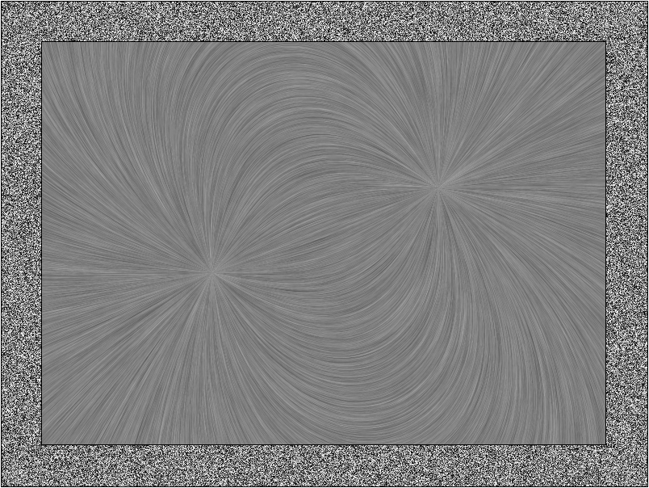

# deLICious

## Synopsis

This is an [angular](https://angular.io/) App for the purpose of visualizing vector fields. This is done by 'Line Integral Convolution' (short [LIC algorithm](http://cs.brown.edu/courses/csci2370/2000/1999/cabral.pdf)).

## Installation & Running the App

1. Clone this
2. Install [angular cli](https://github.com/angular/angular-cli)
3. npm install
4. ng serve
5. [http://localhost:4200](http://localhost:4200)

## Samples

